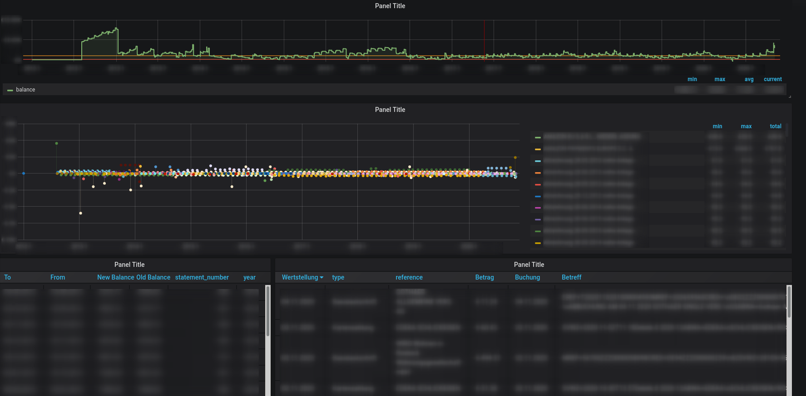
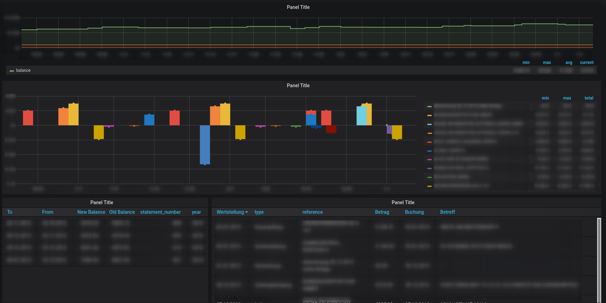

# DKBBanking

This is a python project that can parse DKB Statement pdfs and export them to InfluxDB. From there the data can be used in a frontend like Grafana.

## Usage
Show possible parameters:  
``influxBanking.py -h"``

Some sample parameters:  
``influxBanking.py --host "192.168.1.1" -l "path/to/statement/files"``

It is expected that the statement file names are as exported from the DKB online Banking. If they don't match they are ignored (and such errors are currently not handled understandable).

## Software Prerequisites

- [pdftotext](https://www.xpdfreader.com/pdftotext-man.html)
- python3
- python influx client ``pip3 install influxdb``
- regex ``pip3 install regex``
- influxdb server

## Grafana Sample 

In doc/grafana is a grafana sample which displays the data like seen in the pictures below. This might be a good start to make a more sophisticated representation

